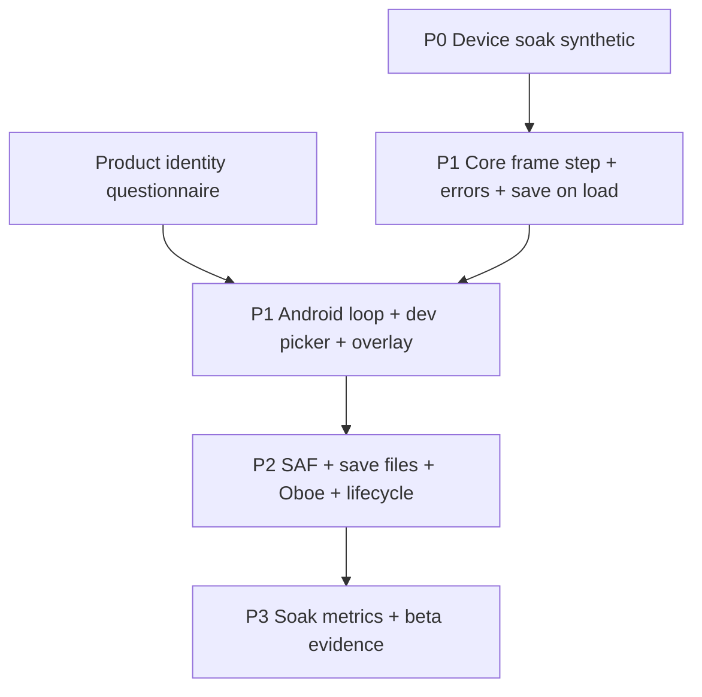

# Android ROM Play Roadmap

**Status:** Planning (Jun 2026)  
**Sources:** `GBA_Emulator` (main, PR #2 merged), sibling `GbaEmulatorAndroid` dev shell  
**Workspace:** `C:\Workspace\Project_Android` — `GbaEmulatorAndroid` is linked via `includeBuild("GbaEmulatorAndroid")` in `settings.gradle.kts`; the app lives as a sibling module, not inside this repository.

**Legal:** This project does **not** ship ROMs, BIOS, or commercial game assets. Users must supply their own legally obtained ROM bytes. Do not commit ROMs, BIOS dumps, or user save blobs to git. Retail cartridge use is private manual smoke only (see §4); never publish compatibility claims for commercial titles.

---

## 1. Goal definition

### Playable test harness (target for this roadmap)

A **developer-facing** Android app that lets *you* supply legal ROM bytes and manually verify the engine on hardware:

- Load ROM from **user-supplied bytes** (no ROMs in repo/APK).
- Show a **240×160** picture that updates over time.
- Map **touch / gamepad** to `KeypadButton` masks.
- Surface **load/run failures** (rejected ROM, fetch failure, unsupported opcode).
- Optional **silent or minimal audio** to confirm APU drain; polish not required.

Success looks like: *pick a file → see boot/title → press Start → something changes on screen* — not “runs all retail games.”

### Beta product (explicitly later)

Controlled external beta per `docs/controlled-beta-readiness.md`: device soak artifacts, frame pacing p95, audio underruns, thermal notes, SAF save persistence, governance, rollback. **Blocked today** until Device Evidence row is PASS.

### What “test with actual ROMs” means

| Allowed | Not allowed in repo/docs claims |
| --- | --- |
| **Homebrew** you built or downloaded with a clear license | Bundled commercial ROMs |
| **mGBA Game Boy Advance Test Suite** ROM you build locally (workstation already green on 13 targets) | “Commercial compatibility” marketing |
| **Your own dumps** you legally possess; load only on your device | BIOS files in APK or git |
| **1–2 retail titles** for *private manual* smoke only, with disclaimer in test notes | Publishing compatibility results |

**Policy alignment:** `docs/open-issues-status.md` claims policy — legal mGBA suite + synthetic evidence only until device artifacts exist.

---

## 2. What exists today (baseline)

### Core (`GBA_Emulator`)

| API | Role |
| --- | --- |
| **`gba_android_core_*`** (`android_core_bridge.hpp`) | Opaque handle; `load_rom` → `MemoryBus::load_game_pak_rom`; `run(max_steps)` → `CoreSession::run`; `reset`; `state_hash`. **No** render/input/audio. Thread-safe mutex in bridge impl. |
| **`AndroidRuntime`** (`android_runtime.hpp`) | `load_rom`, `reset`, `set_button_mask`, `set_render_control`, `step_frame(max_steps)`, `framebuffer()` / `pixel()`, `last_audio_batch()`. Status: `ok`, `invalid_argument`, `rom_rejected`, `input_rejected`. |
| **`CoreSession`** | `step()`, `run(max_steps)`, `save_state` / `load_state`, `state_hash`. |
| **`MemoryBus`** | `load_game_pak_rom`, `game_pak_header()`, `detect_game_pak_save_type()`, `configure_game_pak_save()`, import/export save bytes — save detect/configure + **`configure_for_game_boot`** (BIOS HLE, PC `0x08000000`) on `AndroidRuntime::load_rom` / bridge `load_rom`. |
| **`CoreSchedulerRunResult`** | `stop_reason` exposed via JNI `nativeStepFrame` (7-tuple); `fetch_failures` / `final_pc` not yet in Kotlin overlay. |
| **Workstation** | 13 mGBA suites GREEN; 7 video oracle aliases; `run-core-tests.ps1` includes `android_core_bridge_test`, `android_runtime_test`. |

**Boot policy (2026-06-04):** `configure_for_game_boot()` sets BIOS HLE and ROM entry PC on load (fixes retail frame-0 `fetch_failed` at BIOS `0x4000`). **Remaining gap:** `step_frame` is cycle-bounded per frame budget but still uses a large step cap; long-run pacing/thermal validation is separate.

### Android (`GbaEmulatorAndroid`)

| Done | Missing / follow-up |
| --- | --- |
| Compose shell (`MainActivity` → `GbaEmulatorScreen` + `GameScreen`) | Process-wide pause on `onStop` / `ProcessLifecycleOwner` |
| CMake links full core subset + `libgbaemulator.so` | Cycle-bounded `step_frame` (280,896 cycles/frame) |
| JNI: `GbaCoreBridge` + `GbaRuntimeBridge` (`gba_jni.cpp`) | Oboe/AAudio playback (batch counts only today) |
| `BridgeSelfTest` / `RuntimeSelfTest` + `SyntheticRom` | Save file + save-state SAF UX |
| SAF ROM import (`OpenDocument` + persistable URI) | Save export/import URIs |
| `EmulatorSession` + `GameScreen` vsync loop | Fast-forward |
| `Rgb565Framebuffer` + runtime self-test preview | GLES path (only if Compose blit fails soak) |
| `nativeCopyFramebuffer` / `nativePixel` / `stop_reason` in `nativeStepFrame` | `set_render_control` JNI |
| `TouchGameControls` overlay | 10+ min thermal / battery artifact |
| arm64-v8a + x86_64, minSdk 26 | Recorded hardware model in evidence (adb replay template exists) |
| Package `com.gba.emulator.shell` | Store-ready branding |
| `GbaEmulatorTheme` + Flowframe tokens (partial) | Full product identity questionnaire (§11) |

**Doc alignment (2026-06-03):** `open-issues-status.md`, `android-integration-plan.md`, and
[`GbaEmulatorAndroid/PROJECT_CONTEXT.md`](../../GbaEmulatorAndroid/PROJECT_CONTEXT.md) describe the
same JNI/SAF/game-loop surface. P0 synthetic soak: [`evidence/2026-06-03-android-device-soak-synthetic-pass.md`](evidence/2026-06-03-android-device-soak-synthetic-pass.md).

**UI today (intentionally generic):** headline “GBA Emulator (dev shell)”, default `MaterialTheme` color schemes, `app_name` “GBA Emulator Dev” — placeholder until product identity questionnaire (§11) is answered and tokens land in `GbaEmulatorTheme.kt`.

---

## 3. Phased milestones

### P0 — Device trust (synthetic only)

**Purpose:** Prove native bridge on real hardware before ROM UX.

| Area | Work |
| --- | --- |
| Core | No change required if workstation gates pass. |
| Android | `assembleDebug`, install, **Run bridge self-test** + **Run runtime self-test**, lifecycle smoke per `android-device-soak-checklist.md`. |
| Testing | Synthetic ROM only; record evidence template; update `controlled-beta-readiness.md` Device Evidence row. |

**Definition of done**

- Dated artifact: device model, ABI, APK id, both self-tests **PASS**, cold start + Home resume OK.
- Workstation: `run-core-tests.ps1` PASS same day.

**Effort / risk:** Low / Low

---

### P1 — Minimal ROM play harness (bytes → screen → input)

**Purpose:** Play legal ROMs you place on device (see testing §4); not store-ready.

#### Core / API gaps

| Item | Detail |
| --- | --- |
| **Frame-accurate step** | Extend `AndroidRuntime` (or new `step_frame_cycles`) to advance scheduler until `scheduler_cycles` delta ≥ `PpuTiming::kCyclesPerFrame`, or stop at VBlank boundary — replace “N instructions” as the primary game-loop contract. |
| **Load pipeline** | After `load_game_pak_rom`: optional `game_pak_header()` validation surface; `detect_game_pak_save_type()` + `configure_game_pak_save()`; empty save buffer for SRAM/Flash/EEPROM. |
| **Error surfacing** | Plumb `CoreSchedulerRunResult::stop_reason`, `fetch_failures`, `unsupported_steps` into `AndroidRuntimeFrameResult` + JNI (`nativeStepFrame` LongArray or side channel). |
| **Reset semantics** | Document hard vs soft reset for “Restart game” (today `load_rom` calls `session_.reset()` then reload). |
| **Input** | Already: `set_button_mask` with `KeypadButton` bits (`0x03FF`); reject `0x0400`+ as `input_rejected`. |
| **Framebuffer** | Already: RGB565 `nativeCopyFramebuffer` (38,400 shorts). |
| **Audio batch** | JNI: copy `last_audio_batch()` (`ApuMixedSample`) for Kotlin playback stub (can be silent in P1 DoD). |
| **Render control** | JNI `set_render_control` if games need mode/window toggles beyond defaults. |

#### Android UX

| Item | Detail |
| --- | --- |
| **Dev ROM ingest (interim)** | Until P2 SAF: `ACTION_OPEN_DOCUMENT` with `application/octet-stream` / `*/*` and persist URI read permission, **or** debug-only read from app cache after `adb push` (document in test notes only). |
| **ROM metadata screen** | After load: show `CartridgeHeader` title/game code (JNI read from `game_pak_header()`), ROM size, detected save type, load status. |
| **Game screen** | `Choreographer` / `LaunchedEffect` loop: one native `stepFrame` per vsync; blit via existing `Rgb565Framebuffer`; single long-lived `GbaRuntimeBridge` handle (not `withHandle` per frame). |
| **Input overlay** | Transparent Compose controls → `setButtonMask`; combine pressed bits. |
| **Pause** | `onPause`: stop loop; `onResume`: optional reset or continue (document choice). |

**Definition of done**

- User selects a **legal homebrew** `.gba` (or mGBA suite ROM they built): metadata screen shows title/size.
- Game screen: **visible changing framebuffer** for ≥30 s.
- User presses **Start** (and one other button): `KEYINPUT` effect observable (menu advances or state hash / screen change).
- On corrupt file: UI shows `rom_rejected` or readable error, no native crash.
- Logcat tag documents `stop_reason` if emulation stops early.

**Effort / risk:** High (frame stepping) / Medium (Android loop)

---

### P2 — Durable UX + audio + saves

| Item | Detail |
| --- | --- |
| **SAF** | Production path: `ACTION_OPEN_DOCUMENT`, no bundled ROMs; optional save export/import URIs. |
| **Save persistence** | `export_game_pak_save` / `import_game_pak_save` to user-chosen file; backup-before-write per beta doc. |
| **Audio** | Oboe or AAudio consuming mixed samples; underrun counter in UI. |
| **Lifecycle** | Pause stops audio + thread; leak check on rotate; `onStop` behavior defined. |
| **Optional fast-forward** | 2×/3× frame budget multiplier (not accuracy claim). |

**Definition of done**

- ROM + save round-trip: play → write save (game that uses SRAM) → force-stop app → reload → save still present (same bytes).
- 10-minute play session: no permanent crash; audio audible on at least one homebrew with sound.
- SAF-only path for ROM (remove adb-only path from default UX).

**Effort / risk:** Medium / Medium

---

### P3 — Measurement & beta gate prep

| Item | Detail |
| --- | --- |
| **Device performance** | Port `run_android_performance_gate` (`android_performance_gate.hpp`) to on-device script or debug screen: p95 frame ms, missed frames, audio underruns. |
| **Thermal / battery soak** | 10+ min per `controlled-beta-readiness.md`; record notes. |
| **Regression** | Before each candidate: workstation `run-credibility-matrix.ps1 -FailOnRegression` + Android `assembleDebug` + self-tests. |

**Definition of done**

- One recorded soak artifact with pacing metrics + thermal note.
- Device Evidence row eligible for PASS (still no commercial compatibility claim).

**Effort / risk:** Medium / Medium

---

## 4. Testing strategy

| Class | Where | Purpose |
| --- | --- | --- |
| **Synthetic 12-byte ROM** | App self-tests | JNI/regression parity with C++ tests |
| **mGBA suite ROM** (local build) | Workstation primary; optional on-device for one target (e.g. `memory`) | Correctness anchor; already GREEN on PC |
| **Homebrew** (e.g. small open demos, licensed PD ROMs) | P1 DoD on device | Real load path, title screen, input |
| **mGBA `video` probes** | Workstation `run-mgba-suite.ps1 -VideoProbe …` | Bounded framebuffer hashes (7 aliases green) |
| **1–2 commercial titles** | **Manual only**, private device, disclaimer in personal notes | Subjective smoke; **never** in README, store, or matrix claims |

**Disclaimer text (for personal test logs):** “Retail cartridges used only as private compatibility smoke on hardware I own; not a compatibility guarantee or redistribution.”

---

## 5. Dependencies (ordering)



| Question | Recommendation |
| --- | --- |
| Device soak before SAF? | **Yes — P0 before P1 ROM UX.** Soak does not require real ROMs (`android-device-soak-checklist.md`). |
| SAF before soak with user ROMs? | **P0 synthetic → P1 dev picker → P2 SAF.** Long thermal soak with real ROMs belongs in **P2/P3** once load/save stable. |
| Audio before video? | **Video first** for P1 DoD; audio can trail to P2. |
| Workstation gates vs Android? | Keep `run-core-tests.ps1` green **before** each Android milestone; add JNI tests mirroring new fields when core changes. |
| Theme before ROM picker screens? | **Yes.** Complete §11 questionnaire and land Compose theme tokens in `GbaEmulatorTheme.kt` **before** building library/browse/game shell UI (avoids rework). |

---

## 6. Effort / risk table

| Item | Effort | Risk | Phase |
| --- | --- | --- | --- |
| P0 device soak artifact | Low | Low | P0 |
| Product identity + theme tokens | Low | Low | Pre–P1 UI |
| Frame-cycle `step_frame` | High | High | P1 |
| JNI stop_reason + header/save metadata | Medium | Low | P1 |
| Auto `configure_game_pak_save` on load | Low | Medium | P1 |
| Compose game loop + framebuffer | Medium | Medium | P1 |
| Touch overlay / keypad | Low | Low | P1 |
| Dev document picker (non-SAF) | Low | Low | P1 |
| SAF + persistable URI | Medium | Medium | P2 |
| Save file SAF round-trip | Medium | High | P2 |
| Oboe/AAudio playback | Medium | Medium | P2 |
| Lifecycle pause/leak | Low | Medium | P2 |
| Fast-forward | Low | Low | P2 |
| On-device performance gate | Medium | Medium | P3 |
| 10+ min thermal soak | Low | Medium | P3 |
| Retail game manual smoke | Low | **High** (legal/expectation) | P3 private only |

---

## 7. Out of scope (this roadmap)

- Link cable / multiplayer SIO beyond suite stubs  
- Cheats, rewind, shaders, netplay  
- Play Store listing, production package/branding finalization (track separately from `com.gba.emulator.shell`)  
- BIOS bundle or HLE service claims  
- Linking **LLMHostAndroid** (reference only per integration plan)  
- Commercial compatibility matrix or public superiority claims  
- Checked-in ROMs, BIOS, or user save blobs in git  

---

## 8. Immediate next 3 tasks (agent-assignable)

1. **P0 — Record device soak** — **done (synthetic template)**  
   Artifact: [`evidence/2026-06-03-android-device-soak-synthetic-pass.md`](evidence/2026-06-03-android-device-soak-synthetic-pass.md). Re-run adb steps on hardware and fill model/ABI before external beta.

2. **P1 core — Frame step + diagnostics JNI**  
   In `GBA_Emulator`: implement cycle-bounded `AndroidRuntime::step_frame` (or sibling API); on `load_rom`, call `detect_game_pak_save_type` + `configure_game_pak_save`; extend JNI/Kotlin to return `stop_reason`, `fetch_failures`, and cartridge header fields; add/update `android_runtime_test.cpp` + workstation gate.

3. **Product identity — Answer §11, then theme tokens**  
   Stakeholder completes questionnaire; implement `ColorScheme`, typography, shapes, and motion in `GbaEmulatorAndroid` `GbaEmulatorTheme.kt` before ROM library / game shell screens.

*(Alternate third task if design is deferred: **P1 Android — Game loop screen** with dev picker, persistent runtime handle, `Choreographer` + overlay — using neutral tokens only.)*

---

## 9. API quick reference (for implementers)

### C bridge (`extern "C"`)

```cpp
void* gba_android_core_create();
void gba_android_core_destroy(void* handle);
AndroidBridgeStatus gba_android_core_reset(void* handle);
AndroidBridgeStatus gba_android_core_load_rom(void* handle, const uint8_t* bytes, size_t size);
AndroidBridgeStatus gba_android_core_run(void* handle, uint32_t max_steps, AndroidBridgeRunResult* result);
uint64_t gba_android_core_state_hash(void* handle);
```

### `AndroidRuntime` (C++ / JNI target)

```cpp
AndroidRuntimeStatus reset();
AndroidRuntimeStatus load_rom(const std::vector<uint8_t>& rom);
AndroidRuntimeStatus set_button_mask(uint16_t pressed_mask);  // KeypadButton bits
AndroidRuntimeFrameResult step_frame(uint32_t max_steps);
const PpuRenderer::Framebuffer& framebuffer() const;
const std::vector<ApuMixedSample>& last_audio_batch() const;
```

### Kotlin today

- `GbaCoreBridge.nativeLoadRom` / `nativeRun` → bridge API  
- `GbaRuntimeBridge.nativeLoadRom` / `nativeStepFrame` / `nativeCopyFramebuffer` / `nativeSetButtonMask`  
- **Not yet:** Oboe playback, cartridge header/save type JNI, `set_render_control`, save-state JNI

### Keypad masks (`KeypadButton`)

`A=0x0001`, `B=0x0002`, `Select=0x0004`, `Start=0x0008`, `Right/Left/Up/Down`, `R=0x0100`, `L=0x0200`; valid mask ⊆ `0x03FF`.

---

## 10. Verification commands

**Workstation (`GBA_Emulator`):**

```powershell
.\tools\run-core-tests.ps1
.\tools\run-credibility-matrix.ps1 -FailOnRegression
```

**Android (`GbaEmulatorAndroid`):**

```bash
./gradlew :app:assembleDebug
adb install -r app/build/outputs/apk/debug/app-debug.apk
```

---

## 11. Product identity & visual design (questionnaire)

**Purpose:** Decide how the app should look and feel *before* building ROM picker, library, and game shell UI. The default dev shell (generic Material 3, “GBA Emulator” title) is intentionally unbranded. Answers here should drive **Compose theme tokens** in `GbaEmulatorAndroid` (`GbaEmulatorTheme.kt`, `themes.xml`, launcher, strings) — not one-off colors in screens.

**How to use:** Copy answers into an issue or `docs/design-decisions.md` when created. Implementation order: tokens → components → ROM/browse/game flows.

---

### A. Positioning & metaphor

**Q1. Primary visual metaphor** (pick one, or describe in ≤15 words):

- [ ] A) Handheld hardware homage (GBA SP / micro silhouette, bezels, plastic)
- [ ] B) Software “player” (minimal chrome, content-first, like a music app)
- [ ] C) Archival / library (shelves, cards, museum labels)
- [ ] D) Workshop / lab instrument (technical, neutral, dev-tool aesthetic)
- [ ] E) Other: _______________

**Q2. What must the app *not* look like?** (short answer)

*Example: purple gradient hero, “GBA Emulator” wordmark, fake d-pad wallpaper, My Boy clone layout.*

**Q3. One-sentence product promise** (shown on first launch or about — not “play all games”):

_______________

---

### B. Color & surfaces

**Q4. Base palette direction:**

- [ ] A) Warm neutrals + one accent (earth, paper, ink)
- [ ] B) Cool neutrals + one accent (slate, cyan, steel)
- [ ] C) High-contrast monochrome (black/white + single highlight)
- [ ] D) Saturated retro (limited 4–6 colors, poster-like)
- [ ] E) Follow game art (adaptive scrim; shell stays neutral)

**Q5. Accent color role:**

- [ ] A) Actions only (buttons, FAB)
- [ ] B) Navigation + selection (tabs, list selection)
- [ ] C) In-game overlay only (controls), shell is grayscale
- [ ] D) No strong accent — typography carries hierarchy

**Q6. Game picture surround** (letterbox / pillarbox around 240×160):

- [ ] A) Matte black (cinema)
- [ ] B) Subtle texture or gradient (brand)
- [ ] C) Dynamic color sampled from last frame (experimental)
- [ ] D) User-selectable per theme

---

### C. Typography & density

**Q7. Type family:**

- [ ] A) System default (Roboto / platform)
- [ ] B) Geometric sans (clean, modern)
- [ ] C) Humanist sans (friendly, readable)
- [ ] D) Monospace for metadata only; sans for UI
- [ ] E) Custom/licensed font: _______________

**Q8. Information density on library/browse screens:**

- [ ] A) Spacious cards, large art, few items per screen
- [ ] B) Compact list, metadata in subtitles
- [ ] C) Grid of tiles (cover-forward)
- [ ] D) Table / spreadsheet (power-user)

---

### D. Shell vs in-game chrome

**Q9. Where does “brand” live?**

- [ ] A) Shell only (library/settings branded; play screen nearly chrome-free)
- [ ] B) Play screen too (persistent branded frame around game)
- [ ] C) Nowhere during play — full-bleed game, gestures for menu

**Q10. System bars (status/nav) during play:**

- [ ] A) Hidden immersive; edge swipe to reveal
- [ ] B) Visible, themed to match shell
- [ ] C) Visible, always dark for OLED contrast
- [ ] D) User toggle in settings

---

### E. Controls & layout

**Q11. Default control layout on phone (portrait):**

- [ ] A) D-pad left, A/B right (classic emulator)
- [ ] B) D-pad right, A/B left (left-thumb reach)
- [ ] C) Floating draggable pads
- [ ] D) Minimal — rely on external controller; touch optional
- [ ] E) Landscape-only for touch play

**Q12. Should on-screen controls mimic physical GBA labels (L/R/SELECT/START)?**

- [ ] A) Yes, labeled like hardware
- [ ] B) Icons only, no “GBA” wording
- [ ] C) Abstract shapes (no Nintendo-adjacent labeling)

**Q13. Haptic / tactile feedback on button press:**

- [ ] A) Light tap on every press
- [ ] B) Only on A/B/Start
- [ ] C) Off by default; opt-in
- [ ] D) Never

---

### F. Library & browse UX

**Q14. ROM discovery model:**

- [ ] A) Single “Open ROM” — no library
- [ ] B) Recent list only (session memory)
- [ ] C) Full library with folders/tags (user-managed)
- [ ] D) SAF tree bookmark + flat recent

**Q15. ROM list item shows** (check all that apply):

- [ ] Title from header
- [ ] File name
- [ ] Game code / region
- [ ] Last played
- [ ] Save indicator
- [ ] Custom cover (user-provided art only)

**Q16. Empty state tone:**

- [ ] A) Instructional (“Add a ROM you own…”)
- [ ] B) Minimal icon + one line
- [ ] C) Playful / character (if original art exists)
- [ ] D) Legal-forward disclaimer prominent

---

### G. Motion & sound branding

**Q17. Motion level:**

- [ ] A) None (instant transitions)
- [ ] B) Subtle (Material motion, <200ms)
- [ ] C) Expressive (shared-axis, hero transitions into play)
- [ ] D) Respect “reduce motion” only; otherwise B

**Q18. UI sound design:**

- [ ] A) Silent UI
- [ ] B) Subtle clicks on navigation only
- [ ] C) Distinct branded UI sounds (not game audio)
- [ ] D) Optional pack in settings

**Q19. Relationship between UI sounds and emulated game audio:**

- [ ] A) Never overlap; duck UI when game unmuted
- [ ] B) Independent volumes in settings

---

### H. Light/dark & accessibility

**Q20. Theme default:**

- [ ] A) Follow system (current behavior)
- [ ] B) Dark default
- [ ] C) Light default
- [ ] D) Fixed single theme (no toggle)

**Q21. Minimum touch target priority:**

- [ ] A) WCAG 48dp everywhere
- [ ] B) Larger on play screen only (60dp+)
- [ ] C) Compact controls; accessibility mode enlarges

**Q22. Color-blind / contrast:**

- [ ] A) WCAG AA for all text
- [ ] B) High-contrast theme toggle
- [ ] C) Deuteranopia-safe accent choices by default

---

### I. Nostalgia vs modern

**Q23. Nostalgia dial (1 = modern tool, 5 = period replica):**

1 — 2 — 3 — 4 — 5

**Q24. Pixel art scaling default** (in-game image filter):

- [ ] A) Integer nearest (crisp pixels)
- [ ] B) Integer + subtle scanlines overlay
- [ ] C) Bilinear (softer)
- [ ] D) User setting per game

---

### J. References

**Q25. Apps to embrace** (name 1–3; what to borrow):

_______________

**Q26. Apps to avoid** (name 1–3; what to reject):

_______________

**Q27. Optional mood board** (links, Figma, screenshots — no copyrighted game art in repo):

_______________

---

### K. Implementation hook (for agents)

After Q1–Q27 are answered, implement in this order:

1. `ColorScheme` + `Typography` + `Shapes` in `GbaEmulatorTheme.kt`
2. `strings.xml` app name / taglines per Q3
3. Launcher icon brief (not a stock purple gamepad)
4. Reusable components: `RomListItem`, `GameViewport`, `ControlOverlay` using tokens only
5. Then P1 ROM screens per §3

---

## Related documents

- `docs/android-integration-plan.md` — module map and JNI surface
- `docs/open-issues-status.md` — claims policy and blockers
- `docs/android-device-soak-checklist.md` — P0 evidence template
- `docs/controlled-beta-readiness.md` — beta gate checklist
